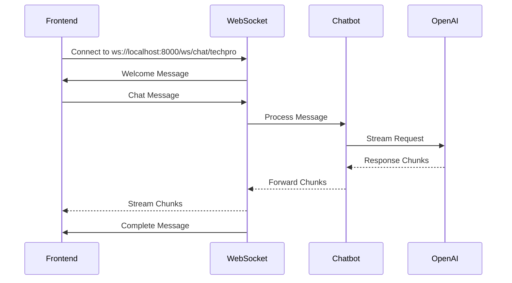

# WebSocket Streaming Chat Documentation

## Overview

The Multi-Brand Chatbot API v2.0 provides real-time streaming chat functionality through WebSocket connections. This allows for **live typing effects** and **progressive response building** as the AI generates responses.

## WebSocket Endpoint

```
ws://localhost:8000/ws/chat/{brand_id}
```

**Parameters:**
- `brand_id` (required): The ID of the brand you want to chat with (e.g., "techpro")

## Connection Flow



## Message Format Specification

### Client → Server Messages

#### 1. Chat Message
```json
{
  "type": "chat",
  "data": {
    "message": "I need a laptop for business work",
    "conversation_id": "optional-conversation-id",
    "user_id": "optional-user-id", 
    "voice": false
  }
}
```

**Fields:**
- `type`: Always `"chat"` for chat messages
- `data.message` (required): The user's message
- `data.conversation_id` (optional): Continue existing conversation
- `data.user_id` (optional): User identifier for tracking
- `data.voice` (optional): Set to `true` for voice-optimized responses (1 sentence max)

#### 2. Ping Message
```json
{
  "type": "ping",
  "data": {}
}
```

### Server → Client Messages

#### 1. Welcome Message (First message after connection)
```json
{
  "type": "welcome",
  "data": {
    "message": "Welcome to TechPro Solutions! How can I help you today?",
    "brand_id": "techpro",
    "brand_name": "TechPro Solutions"
  }
}
```

#### 2. Response Chunk (Streaming content)
```json
{
  "type": "chunk",
  "data": {
    "content": "I'd be happy to help you find",
    "is_final": false,
    "conversation_id": "conv-123456789",
    "suggested_products": null,
    "confidence_score": null
  }
}
```

**Fields:**
- `content`: Partial response text to append to UI
- `is_final`: Always `false` for chunks
- `conversation_id`: ID for this conversation
- `suggested_products`: Always `null` in chunks
- `confidence_score`: Always `null` in chunks

#### 3. Complete Response (Final message)
```json
{
  "type": "complete",
  "data": {
    "content": "",
    "is_final": true,
    "conversation_id": "conv-123456789",
    "suggested_products": [
      {
        "id": "laptop-002",
        "name": "Dell XPS 13 Plus",
        "description": "Ultra-portable business laptop...",
        "category": "Laptop",
        "price": 19999000.00,
        "features": ["Intel Core i7", "16GB RAM"],
        "specifications": {
          "processor": "Intel Core i7-1255U",
          "memory": "16GB LPDDR5x",
          "storage": "512GB SSD"
        },
        "availability": true
      }
    ],
    "confidence_score": 0.85
  }
}
```

**Fields:**
- `content`: Usually empty string for complete message
- `is_final`: Always `true` for final message
- `suggested_products`: Array of product recommendations (can be empty)
- `confidence_score`: Match confidence (0.0 to 1.0, or null if no products)

#### 4. Error Message
```json
{
  "type": "error",
  "data": {
    "message": "Brand 'invalid-brand' not found or inactive"
  }
}
```

#### 5. Pong Response (Reply to ping)
```json
{
  "type": "pong",
  "data": {
    "timestamp": "2024-01-20T10:30:00"
  }
}
```

## Frontend Implementation Examples

### JavaScript/TypeScript

```javascript
class ChatbotWebSocket {
    constructor(brandId) {
        this.brandId = brandId;
        this.socket = null;
        this.conversationId = null;
        this.currentMessage = '';
    }

    connect() {
        const wsUrl = `ws://localhost:8000/ws/chat/${this.brandId}`;
        this.socket = new WebSocket(wsUrl);

        this.socket.onopen = (event) => {
            console.log('Connected to chatbot');
            this.onConnectionOpen(event);
        };

        this.socket.onmessage = (event) => {
            const message = JSON.parse(event.data);
            this.handleMessage(message);
        };

        this.socket.onclose = (event) => {
            console.log('Connection closed');
            this.onConnectionClose(event);
        };

        this.socket.onerror = (error) => {
            console.error('WebSocket error:', error);
            this.onError(error);
        };
    }

    handleMessage(message) {
        switch (message.type) {
            case 'welcome':
                this.onWelcome(message.data);
                break;
                
            case 'chunk':
                this.onChunk(message.data);
                break;
                
            case 'complete':
                this.onComplete(message.data);
                break;
                
            case 'error':
                this.onError(message.data);
                break;
                
            case 'pong':
                this.onPong(message.data);
                break;
                
            default:
                console.warn('Unknown message type:', message.type);
        }
    }

    sendMessage(text, isVoice = false) {
        if (!this.socket || this.socket.readyState !== WebSocket.OPEN) {
            console.error('WebSocket is not connected');
            return;
        }

        const message = {
            type: 'chat',
            data: {
                message: text,
                conversation_id: this.conversationId,
                voice: isVoice
            }
        };

        this.socket.send(JSON.stringify(message));
        
        // Reset current message for new response
        this.currentMessage = '';
        this.onMessageStart();
    }

    sendPing() {
        if (this.socket && this.socket.readyState === WebSocket.OPEN) {
            this.socket.send(JSON.stringify({ type: 'ping', data: {} }));
        }
    }

    close() {
        if (this.socket) {
            this.socket.close();
        }
    }

    // Event handlers (override these in your implementation)
    onConnectionOpen(event) {
        console.log('WebSocket connection opened');
    }

    onConnectionClose(event) {
        console.log('WebSocket connection closed');
    }

    onWelcome(data) {
        console.log('Welcome message:', data.message);
        console.log('Brand:', data.brand_name, '(ID:', data.brand_id + ')');
    }

    onMessageStart() {
        // Called when starting to receive a new message
        console.log('Starting new message...');
    }

    onChunk(data) {
        // Append chunk to current message
        this.currentMessage += data.content;
        this.conversationId = data.conversation_id;
        
        // Update UI with streaming content
        this.updateChatUI(this.currentMessage, false);
        
        console.log('Chunk received:', data.content);
    }

    onComplete(data) {
        this.conversationId = data.conversation_id;
        
        // Handle suggested products
        if (data.suggested_products && data.suggested_products.length > 0) {
            this.displayProducts(data.suggested_products);
        }
        
        // Handle confidence score
        if (data.confidence_score !== null) {
            this.displayConfidence(data.confidence_score);
        }
        
        // Mark message as complete
        this.updateChatUI(this.currentMessage, true);
        
        console.log('Message complete');
        console.log('Suggested products:', data.suggested_products?.length || 0);
        console.log('Confidence:', data.confidence_score);
    }

    onError(data) {
        console.error('Chat error:', data.message);
        this.displayError(data.message);
    }

    onPong(data) {
        console.log('Pong received at:', data.timestamp);
    }

    // UI update methods (implement based on your UI framework)
    updateChatUI(message, isComplete) {
        // Update your chat interface here
        // isComplete indicates if this is the final message
    }

    displayProducts(products) {
        // Display suggested products in your UI
    }

    displayConfidence(score) {
        // Display confidence score in your UI
    }

    displayError(errorMessage) {
        // Display error message in your UI
    }
}

// Usage example
const chatbot = new ChatbotWebSocket('techpro');
chatbot.connect();

// Send a message
chatbot.sendMessage("I need a laptop for business work");

// Send a voice-optimized message
chatbot.sendMessage("What's the price?", true);
```

### React Hook Example

```jsx
import { useState, useEffect, useRef, useCallback } from 'react';

const useChatbotWebSocket = (brandId) => {
    const [socket, setSocket] = useState(null);
    const [connectionStatus, setConnectionStatus] = useState('disconnected');
    const [currentMessage, setCurrentMessage] = useState('');
    const [conversationId, setConversationId] = useState(null);
    const [suggestedProducts, setSuggestedProducts] = useState([]);
    const [confidence, setConfidence] = useState(null);
    const [error, setError] = useState(null);

    const connect = useCallback(() => {
        const wsUrl = `ws://localhost:8000/ws/chat/${brandId}`;
        const ws = new WebSocket(wsUrl);

        ws.onopen = () => {
            setConnectionStatus('connected');
            setError(null);
        };

        ws.onmessage = (event) => {
            const message = JSON.parse(event.data);
            
            switch (message.type) {
                case 'welcome':
                    console.log('Welcome:', message.data.message);
                    break;
                    
                case 'chunk':
                    setCurrentMessage(prev => prev + message.data.content);
                    setConversationId(message.data.conversation_id);
                    break;
                    
                case 'complete':
                    setConversationId(message.data.conversation_id);
                    if (message.data.suggested_products) {
                        setSuggestedProducts(message.data.suggested_products);
                    }
                    if (message.data.confidence_score !== null) {
                        setConfidence(message.data.confidence_score);
                    }
                    break;
                    
                case 'error':
                    setError(message.data.message);
                    break;
            }
        };

        ws.onclose = () => {
            setConnectionStatus('disconnected');
        };

        ws.onerror = (error) => {
            setConnectionStatus('error');
            setError('Connection error');
        };

        setSocket(ws);
    }, [brandId]);

    const sendMessage = useCallback((message, isVoice = false) => {
        if (!socket || socket.readyState !== WebSocket.OPEN) {
            setError('Not connected to chat service');
            return;
        }

        // Reset state for new message
        setCurrentMessage('');
        setSuggestedProducts([]);
        setConfidence(null);
        setError(null);

        const chatMessage = {
            type: 'chat',
            data: {
                message,
                conversation_id: conversationId,
                voice: isVoice
            }
        };

        socket.send(JSON.stringify(chatMessage));
    }, [socket, conversationId]);

    const disconnect = useCallback(() => {
        if (socket) {
            socket.close();
        }
    }, [socket]);

    useEffect(() => {
        return () => {
            disconnect();
        };
    }, [disconnect]);

    return {
        connect,
        disconnect,
        sendMessage,
        connectionStatus,
        currentMessage,
        suggestedProducts,
        confidence,
        error
    };
};

// Usage in React component
const ChatComponent = () => {
    const {
        connect,
        sendMessage,
        connectionStatus,
        currentMessage,
        suggestedProducts,
        confidence,
        error
    } = useChatbotWebSocket('techpro');

    const [inputMessage, setInputMessage] = useState('');

    useEffect(() => {
        connect();
    }, [connect]);

    const handleSendMessage = () => {
        if (inputMessage.trim()) {
            sendMessage(inputMessage.trim());
            setInputMessage('');
        }
    };

    return (
        <div className="chat-container">
            <div className="connection-status">
                Status: {connectionStatus}
            </div>
            
            {error && (
                <div className="error">
                    Error: {error}
                </div>
            )}
            
            <div className="chat-messages">
                {currentMessage && (
                    <div className="bot-message">
                        {currentMessage}
                    </div>
                )}
            </div>
            
            {suggestedProducts.length > 0 && (
                <div className="suggested-products">
                    <h3>Suggested Products:</h3>
                    {suggestedProducts.map(product => (
                        <div key={product.id} className="product">
                            <h4>{product.name}</h4>
                            <p>Price: ${product.price.toLocaleString()}</p>
                            <p>{product.description}</p>
                        </div>
                    ))}
                </div>
            )}
            
            {confidence !== null && (
                <div className="confidence">
                    Match Confidence: {(confidence * 100).toFixed(1)}%
                </div>
            )}
            
            <div className="input-area">
                <input
                    type="text"
                    value={inputMessage}
                    onChange={(e) => setInputMessage(e.target.value)}
                    onKeyPress={(e) => e.key === 'Enter' && handleSendMessage()}
                    placeholder="Type your message..."
                />
                <button onClick={handleSendMessage}>Send</button>
            </div>
        </div>
    );
};
```

### Vue.js Example

```vue
<template>
  <div class="chatbot-container">
    <div class="connection-status" :class="connectionStatus">
      Status: {{ connectionStatus }}
    </div>
    
    <div v-if="error" class="error">
      Error: {{ error }}
    </div>
    
    <div class="chat-messages">
      <div v-if="currentMessage" class="bot-message">
        {{ currentMessage }}
        <span v-if="isTyping" class="typing-indicator">▌</span>
      </div>
    </div>
    
    <div v-if="suggestedProducts.length > 0" class="products">
      <h3>Suggested Products:</h3>
      <div v-for="product in suggestedProducts" :key="product.id" class="product">
        <h4>{{ product.name }}</h4>
        <p>Price: ${{ product.price.toLocaleString() }}</p>
        <p>{{ product.description }}</p>
      </div>
    </div>
    
    <div v-if="confidence !== null" class="confidence">
      Match Confidence: {{ (confidence * 100).toFixed(1) }}%
    </div>
    
    <div class="input-area">
      <input
        v-model="inputMessage"
        @keyup.enter="sendMessage"
        placeholder="Type your message..."
        :disabled="connectionStatus !== 'connected'"
      >
      <button @click="sendMessage" :disabled="connectionStatus !== 'connected'">
        Send
      </button>
    </div>
  </div>
</template>

<script>
export default {
  name: 'ChatbotWebSocket',
  props: {
    brandId: {
      type: String,
      default: 'techpro'
    }
  },
  data() {
    return {
      socket: null,
      connectionStatus: 'disconnected',
      currentMessage: '',
      inputMessage: '',
      conversationId: null,
      suggestedProducts: [],
      confidence: null,
      error: null,
      isTyping: false
    }
  },
  mounted() {
    this.connect();
  },
  beforeUnmount() {
    this.disconnect();
  },
  methods: {
    connect() {
      const wsUrl = `ws://localhost:8000/ws/chat/${this.brandId}`;
      this.socket = new WebSocket(wsUrl);
      
      this.socket.onopen = () => {
        this.connectionStatus = 'connected';
        this.error = null;
      };
      
      this.socket.onmessage = (event) => {
        const message = JSON.parse(event.data);
        this.handleMessage(message);
      };
      
      this.socket.onclose = () => {
        this.connectionStatus = 'disconnected';
        this.isTyping = false;
      };
      
      this.socket.onerror = () => {
        this.connectionStatus = 'error';
        this.error = 'Connection error';
        this.isTyping = false;
      };
    },
    
    handleMessage(message) {
      switch (message.type) {
        case 'welcome':
          console.log('Welcome:', message.data.message);
          break;
          
        case 'chunk':
          this.currentMessage += message.data.content;
          this.conversationId = message.data.conversation_id;
          this.isTyping = true;
          break;
          
        case 'complete':
          this.isTyping = false;
          this.conversationId = message.data.conversation_id;
          if (message.data.suggested_products) {
            this.suggestedProducts = message.data.suggested_products;
          }
          if (message.data.confidence_score !== null) {
            this.confidence = message.data.confidence_score;
          }
          break;
          
        case 'error':
          this.error = message.data.message;
          this.isTyping = false;
          break;
      }
    },
    
    sendMessage() {
      if (!this.inputMessage.trim() || this.connectionStatus !== 'connected') {
        return;
      }
      
      // Reset state
      this.currentMessage = '';
      this.suggestedProducts = [];
      this.confidence = null;
      this.error = null;
      this.isTyping = false;
      
      const message = {
        type: 'chat',
        data: {
          message: this.inputMessage.trim(),
          conversation_id: this.conversationId,
          voice: false
        }
      };
      
      this.socket.send(JSON.stringify(message));
      this.inputMessage = '';
    },
    
    disconnect() {
      if (this.socket) {
        this.socket.close();
      }
    }
  }
}
</script>

<style scoped>
.chatbot-container {
  max-width: 600px;
  margin: 0 auto;
  padding: 20px;
}

.connection-status {
  padding: 10px;
  margin-bottom: 10px;
  border-radius: 4px;
  font-weight: bold;
}

.connection-status.connected {
  background-color: #d4edda;
  color: #155724;
}

.connection-status.disconnected {
  background-color: #f8d7da;
  color: #721c24;
}

.connection-status.error {
  background-color: #f5c6cb;
  color: #721c24;
}

.error {
  background-color: #f5c6cb;
  color: #721c24;
  padding: 10px;
  border-radius: 4px;
  margin-bottom: 10px;
}

.chat-messages {
  min-height: 200px;
  border: 1px solid #ddd;
  padding: 15px;
  margin-bottom: 15px;
  border-radius: 4px;
  background-color: #f9f9f9;
}

.bot-message {
  background-color: #e3f2fd;
  padding: 10px;
  border-radius: 8px;
  margin-bottom: 10px;
}

.typing-indicator {
  animation: blink 1s infinite;
}

@keyframes blink {
  0%, 50% { opacity: 1; }
  51%, 100% { opacity: 0; }
}

.products {
  margin-bottom: 15px;
}

.product {
  border: 1px solid #ddd;
  padding: 10px;
  margin-bottom: 10px;
  border-radius: 4px;
}

.confidence {
  background-color: #d1ecf1;
  padding: 8px;
  border-radius: 4px;
  margin-bottom: 15px;
  font-weight: bold;
}

.input-area {
  display: flex;
  gap: 10px;
}

.input-area input {
  flex: 1;
  padding: 10px;
  border: 1px solid #ddd;
  border-radius: 4px;
}

.input-area button {
  padding: 10px 20px;
  background-color: #007bff;
  color: white;
  border: none;
  border-radius: 4px;
  cursor: pointer;
}

.input-area button:disabled {
  background-color: #6c757d;
  cursor: not-allowed;
}
</style>
```

## Testing Your WebSocket Implementation

### 1. Test Connection
```javascript
// Test basic connection
const ws = new WebSocket('ws://localhost:8000/ws/chat/techpro');
ws.onopen = () => console.log('Connected');
ws.onmessage = (event) => console.log('Received:', JSON.parse(event.data));
```

### 2. Test Message Sending
```javascript
// Send a test message
const message = {
    type: 'chat',
    data: {
        message: 'Hello, I need help with laptops',
        voice: false
    }
};
ws.send(JSON.stringify(message));
```

### 3. Test Streaming Response
```javascript
let fullResponse = '';
ws.onmessage = (event) => {
    const message = JSON.parse(event.data);
    
    if (message.type === 'chunk') {
        fullResponse += message.data.content;
        console.log('Current response:', fullResponse);
    } else if (message.type === 'complete') {
        console.log('Final response:', fullResponse);
        console.log('Products:', message.data.suggested_products);
    }
};
```

## Common Issues and Solutions

### 1. Connection Issues

**Problem:** WebSocket connection fails
```javascript
// Check server is running
fetch('http://localhost:8000/')
  .then(response => response.json())
  .then(data => console.log('Server status:', data))
  .catch(error => console.error('Server not running:', error));
```

**Problem:** Brand not found
```javascript
// Check available brands
fetch('http://localhost:8000/brands/active')
  .then(response => response.json())
  .then(brands => console.log('Available brands:', brands));
```

### 2. Message Format Issues

**Problem:** Messages not processed
```javascript
// Ensure correct message format
const correctFormat = {
    type: 'chat',  // Must be string
    data: {
        message: 'Your message here',  // Must be string
        voice: false  // Must be boolean
    }
};
```

### 3. Streaming Issues

**Problem:** Chunks not arriving
```javascript
// Add error handling
ws.onerror = (error) => {
    console.error('WebSocket error:', error);
};

ws.onclose = (event) => {
    console.log('Connection closed:', event.code, event.reason);
};
```

### 4. JSON Parsing Issues

**Problem:** Invalid JSON received
```javascript
ws.onmessage = (event) => {
    try {
        const message = JSON.parse(event.data);
        // Handle message
    } catch (error) {
        console.error('Invalid JSON received:', event.data);
    }
};
```

## Voice-Optimized Responses

For voice interfaces, set `voice: true` in your message:

```javascript
const voiceMessage = {
    type: 'chat',
    data: {
        message: 'What is your cheapest laptop?',
        voice: true  // Enables voice optimization
    }
};
```

**Voice Response Characteristics:**
- Maximum 1 sentence
- Concise and direct
- Natural for text-to-speech
- Same language detection (English/Indonesian)

## Performance Tips

### 1. Connection Management
```javascript
// Implement reconnection logic
class ReconnectingWebSocket {
    constructor(url) {
        this.url = url;
        this.reconnectInterval = 1000;
        this.maxReconnectInterval = 30000;
        this.reconnectDecay = 1.5;
        this.connect();
    }
    
    connect() {
        this.ws = new WebSocket(this.url);
        
        this.ws.onopen = () => {
            this.reconnectInterval = 1000; // Reset interval
        };
        
        this.ws.onclose = () => {
            setTimeout(() => {
                this.reconnectInterval = Math.min(
                    this.reconnectInterval * this.reconnectDecay,
                    this.maxReconnectInterval
                );
                this.connect();
            }, this.reconnectInterval);
        };
    }
}
```

### 2. Message Queuing
```javascript
class MessageQueue {
    constructor(websocket) {
        this.ws = websocket;
        this.queue = [];
        this.isProcessing = false;
    }
    
    async sendMessage(message) {
        this.queue.push(message);
        if (!this.isProcessing) {
            this.processQueue();
        }
    }
    
    async processQueue() {
        this.isProcessing = true;
        
        while (this.queue.length > 0) {
            const message = this.queue.shift();
            if (this.ws.readyState === WebSocket.OPEN) {
                this.ws.send(JSON.stringify(message));
                // Wait for response before sending next message
                await this.waitForResponse();
            }
        }
        
        this.isProcessing = false;
    }
}
```

## Security Considerations

### 1. Input Validation
```javascript
function validateMessage(message) {
    if (!message || typeof message !== 'string') {
        throw new Error('Message must be a non-empty string');
    }
    
    if (message.length > 1000) {
        throw new Error('Message too long');
    }
    
    return message.trim();
}
```

### 2. Rate Limiting
```javascript
class RateLimiter {
    constructor(maxMessages = 10, windowMs = 60000) {
        this.maxMessages = maxMessages;
        this.windowMs = windowMs;
        this.messages = [];
    }
    
    canSendMessage() {
        const now = Date.now();
        this.messages = this.messages.filter(time => now - time < this.windowMs);
        
        if (this.messages.length >= this.maxMessages) {
            return false;
        }
        
        this.messages.push(now);
        return true;
    }
}
```

This comprehensive documentation should help you implement WebSocket streaming correctly in your frontend! Let me know if you need clarification on any specific part. 